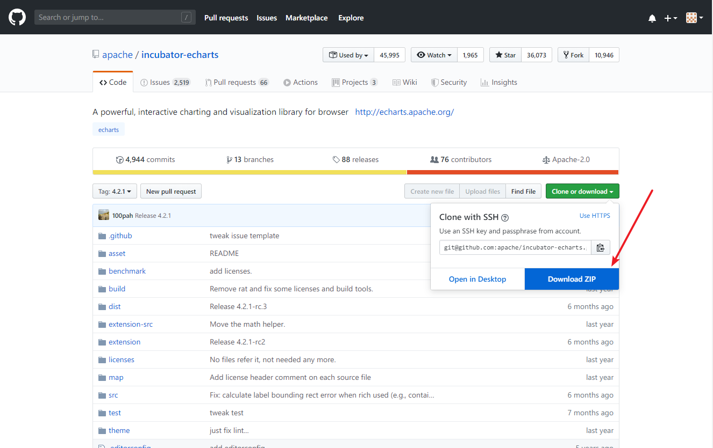
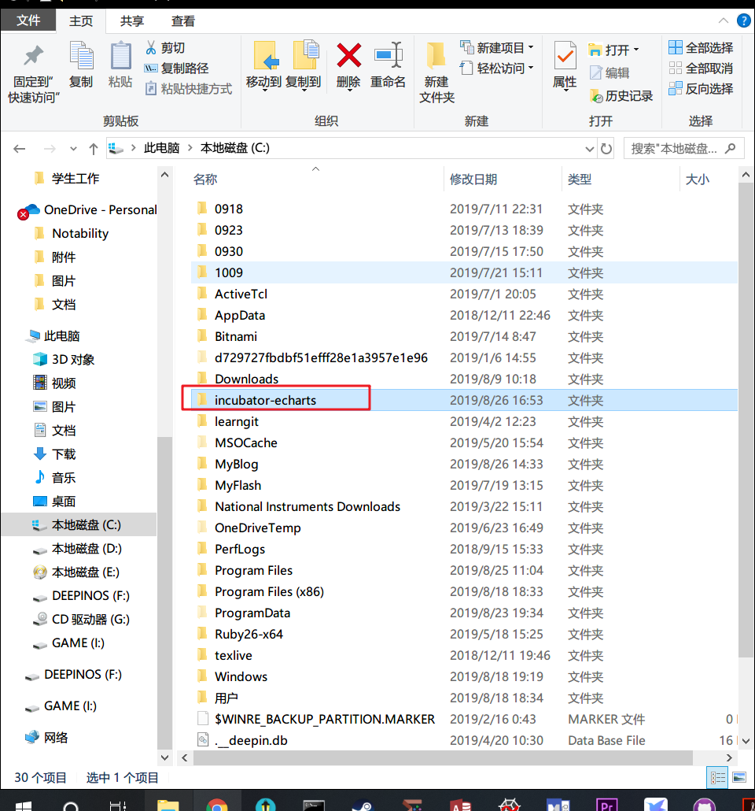
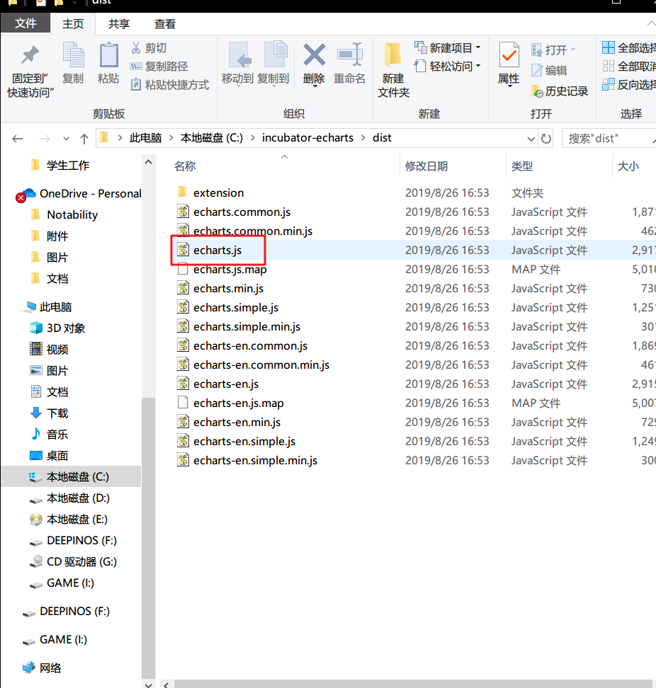

# Echarts安装和使用  

1. 从[官方github页面](https://github.com/apache/incubator-echarts/tree/4.2.1)下载完整的zip安装包.  

2. 解压安装包到任意路径[^1]下, 我这里放到了C盘的根目录.  

[^1]: 考虑到引用的方便, 最好放在根目录下. 
3. 在目录中找到`./dist/echarts.js`, 记住这个文件的绝对路径, 可以使用win10的复制路径功能. 我这里是`'C:\incubator-echarts\dist\echarts.js'`.

4. 新建一个html文件, 用记事本(或其他编辑器)写入以下的html代码(来自官方的示例网站).
注意将其中的`<script src='C:\incubator-echarts\dist\echarts.js'></script>`改为自己的路径.
```html
<!DOCTYPE html>
<html>
<head>
    <meta charset='utf-8'>
    <title>ECharts</title>
    <!-- 引入 echarts.js -->
    <script src='C:\incubator-echarts\dist\echarts.js'></script>
</head>
<body>
    <!-- 为ECharts准备一个具备大小（宽高）的Dom -->
    <div id='main' style='width: 600px;height:400px;'></div>
    <script type='text/javascript'>
        // 基于准备好的dom，初始化echarts实例
        var myChart = echarts.init(document.getElementById('main'));

        // 指定图表的配置项和数据
        var option = {
            title: {
                text: 'ECharts 入门示例'
            },
            tooltip: {},
            legend: {
                data:['销量']
            },
            xAxis: {
                data: ['衬衫','羊毛衫','雪纺衫','裤子','高跟鞋','袜子']
            },
            yAxis: {},
            series: [{
                name: '销量',
                type: 'bar',
                data: [5, 20, 36, 10, 10, 20]
            }]
        };

        // 使用刚指定的配置项和数据显示图表。
        myChart.setOption(option);
    </script>
</body>
</html>
```
5. 保存退出编辑, 使用浏览器打开html, 就能看到绘出的图片.  

6. 官方的[示例网站](https://www.echartsjs.com/examples/#chart-type-line)提供了大量的漂亮示例和源代码, 经过适当修改就能画出我们需要的图片, 非常有用.  


